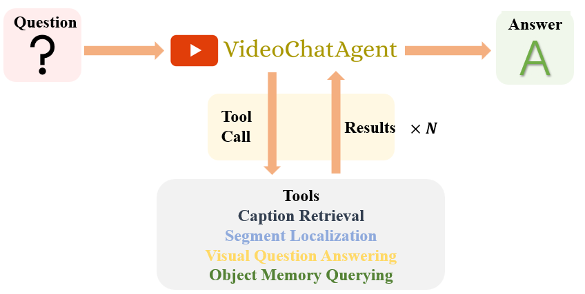
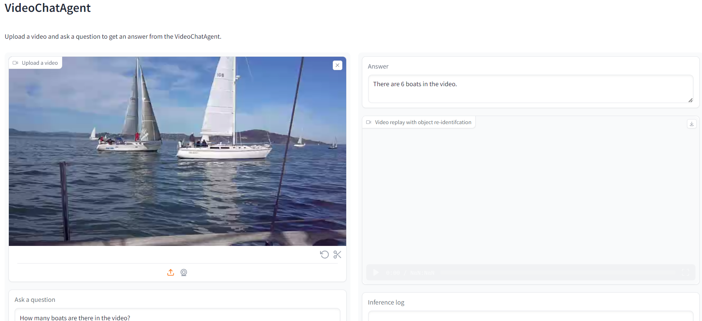

<h1>VideoChatAgent: An agent that you can chat with video</h1>

For the Chinese version of this README, please refer to <a href="README_zh.md">README_zh.md</a>.
# Introduction
VideoChatAgent is a mulit-modal agent that can understand the input video and answer the questions raised by you.You can have a good chat with it about video like ChatGPT, demonstrating the power of agent.
<p align="center">

</p>

My work adopt the same structure: *temporal memory* and *object memory* to store temporal and object information. The model I use is GPT4V. 

In VideoChatAgent, my design principle is to provide a minimal yet sufficient set of tools, with a focus on memory querying. Consider the following tools:
- Caption retrieval: Given time memory $M_t$, the start and end time steps $t_{start}$ and $t_{end}$ as parameters, the tool caption_retrieval(·) simply retrieves the captions from the time memory for these time steps. Due to context limitations, the maximum allowed time window is 15 segments, i.e., it prefers $end < start + 15$.
- Segment localization: The goal is to locate video segments based on a text query $s_{query}$. The tool segment_localization(·) compares features in the spatial memory with the query statement, considering query-video similarity and query-caption similarity. It returns the top 5 video segments.
- Visual question answering: This tool answers a question about a shorter video segment, allowing the acquisition of additional information not included in the time memory captions or object memory states.
- Object memory querying: This tool performs complex information retrieval on objects appearing in the video from the object memory $M_o$. 

Given a video and a question, VideoAgent has two phases: memory construction phase and inference phase. During the memory construction phase, structured information is extracted from the video and stored in the memory. During the inference phase, a LLM is prompted to use a set of tools interacting with the memory to answer the question.


# Demo

I provied a demo for users to try , you can play it in <a href="https://a763ce75f542f09d73.gradio.live">Demo</a>.

Demo video is as followed:
<p align="center">
  <video width="90%" controls>
    <source src="imgs\display.mp4" type="video/mp4">
    Your browser does not support the video tag.
  </video>
</p>

Sometimes it will disconnect because I have limited resourses to run the demo,.If you encounter an error or disconnect, please email me miyapeng78@gmail.com.


# Installation Guide
Use the following command to create the environment named as videochatagent.
```sh
conda env create -f envrionment.yaml
```

Create the environment of [Video-LLaVA](https://github.com/PKU-YuanGroup/Video-LLaVA) by running the following command:
```sh
git clone https://github.com/PKU-YuanGroup/Video-LLaVA
cd Video-LLaVA
conda create -n videollava python=3.10 -y
conda activate videollava
pip install --upgrade pip  # enable PEP 660 support
pip install -e .
pip install -e ".[train]"
pip install flash-attn --no-build-isolation
pip install decord opencv-python git+https://github.com/facebookresearch/pytorchvideo.git@28fe037d212663c6a24f373b94cc5d478c8c1a1d
```

Download the ```cache_dir.zip``` and ```tool_models.zip``` from [here](https://zenodo.org/records/11031717) and unzip them to the directory of ```VideoChatAgent```. This will create two folder ```cache_dir```(the model weights of VideoLLaVA) and ```tool_models```(the model weights of all other models) under ```VideoChatAgent```.

# Usage
Make sure you are under VideoAgent directory.
Enter your OpenAI api key in ```config/default.yaml```.
vqa_tool has two tools,if you choose videollava,you should run the following commands. 

First, open a terminal and run:
```sh
conda activate videollava
python video-llava.py
```
This will start a Video-LLaVA server process that will deal with Visual Question Answering request raised by VideoAgent.
Once you see ```ready for connection!``` in the first process, Then, run the following commands:
If you choose gpt4v,you can just run the following commands:

```sh
conda activate videoagent
python demo.py
```
This will create a Gradio demo shown as follows.
<p align="center">

</p>
You can choose the example videos for inference, or you can also upload your own videos and questions. Once submitted, VideoAgent will start processing your video and store the files under ```preprocess/your_video_name```. After processing the input video, it will answer your question.

The results will provide:
1. the answer to the question
2. the replay with object re-ID of the input video
3. the inference log (chain-of-thought) of VideoAgent

For batch inference, you can run
```sh
conda activate videoagent
python main.py
```
